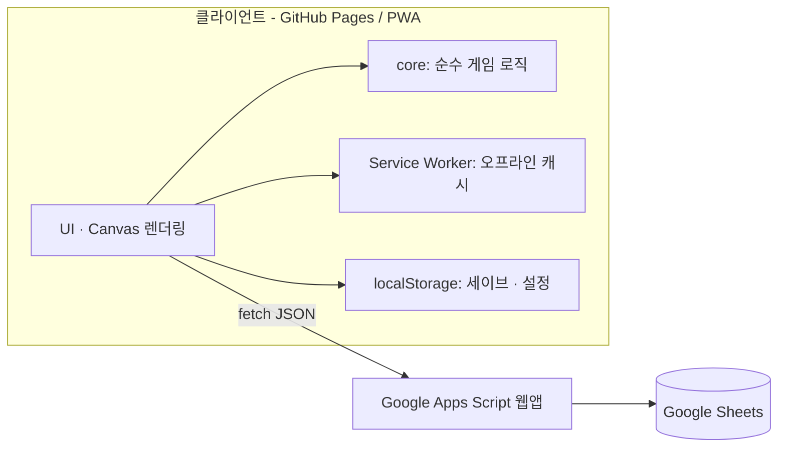
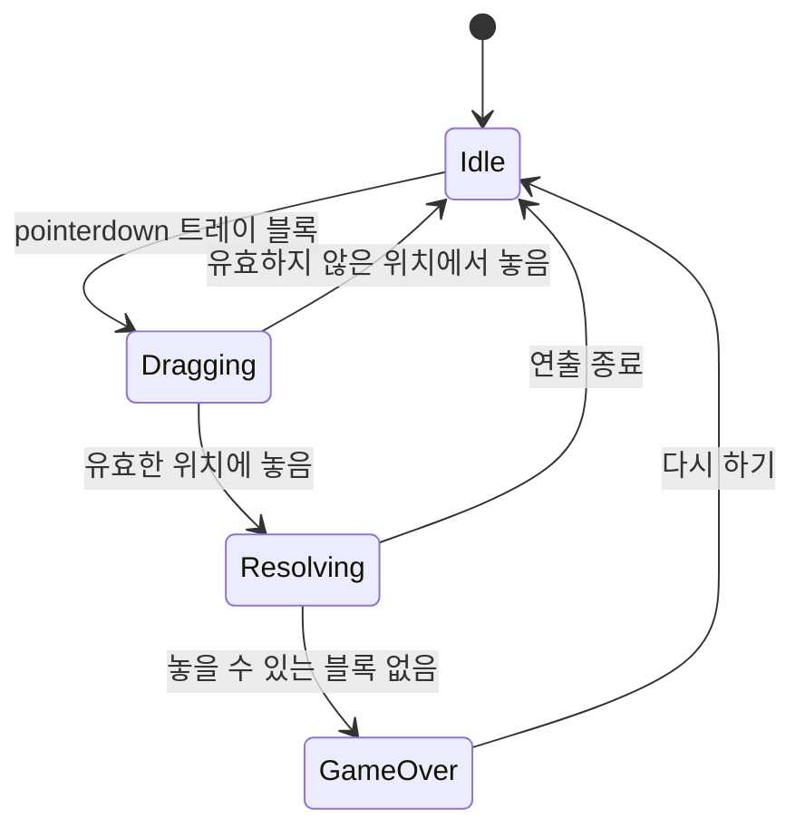

# 블록 블라스트 개발 가이드

> HTML/CSS/JavaScript(프런트엔드) + Google Apps Script(백엔드)로 만드는 8×8 블록 퍼즐 게임.
> 이 문서는 **무엇을, 어떤 구조로, 어떤 순서로** 만들지 정하는 기준 문서다. 구현하면서 바뀌는 내용은 이 문서에 먼저 반영한다.

## 목차

1. [프로젝트 개요](#1-프로젝트-개요)
2. [기술 선택과 아키텍처](#2-기술-선택과-아키텍처)
3. [개발 환경](#3-개발-환경)
4. [프로젝트 구조](#4-프로젝트-구조)
5. [게임 규칙 명세](#5-게임-규칙-명세)
6. [코어 로직 설계](#6-코어-로직-설계)
7. [블록 생성 알고리즘](#7-블록-생성-알고리즘)
8. [렌더링과 입력(UI)](#8-렌더링과-입력ui)
9. [연출: 애니메이션 · 사운드 · 햅틱](#9-연출-애니메이션--사운드--햅틱)
10. [게임 모드](#10-게임-모드)
11. [저장과 오프라인(PWA)](#11-저장과-오프라인pwa)
12. [Google Apps Script 백엔드](#12-google-apps-script-백엔드)
13. [테스트와 품질 기준](#13-테스트와-품질-기준)
14. [배포](#14-배포)
15. [개발 로드맵](#15-개발-로드맵)
16. [코딩 규칙](#16-코딩-규칙)
17. [리스크와 결정이 필요한 항목](#17-리스크와-결정이-필요한-항목)

---

## 1. 프로젝트 개요

| 항목 | 내용 |
| --- | --- |
| 장르 | 블록 퍼즐 (싱글 플레이, 무한 모드 중심) |
| 핵심 루프 | 트레이의 블록 3개를 8×8 보드에 드래그 → 가로/세로 줄 완성 시 제거 → 콤보로 고득점 → 더 놓을 곳이 없으면 종료 |
| 플랫폼 | 모바일 브라우저 우선(터치), 데스크톱 브라우저 지원. 설치형 PWA |
| 필수 요구사항 | **오프라인 플레이**, 부드러운 60fps, 한 손 조작 |
| 서버 기능 | 랭킹(리더보드), 데일리 챌린지 시드/기록 — Google Apps Script + Google Sheets |
| 언어 | 한국어 기본 (문자열은 한 파일에 모아 다국어 확장 가능하게) |

### 1.1 기능 범위

| 구분 | 기능 | 우선순위 |
| --- | --- | --- |
| **MVP** | 클래식 모드: 드래그 앤 드롭, 줄 제거, 점수/콤보, 게임오버, 최고점수 저장 | P0 |
| 연출 | 제거 이펙트(파티클), 콤보 텍스트, 사운드, 진동, 테마 색상 | P1 |
| 오프라인 | PWA(매니페스트 + 서비스 워커) | P1 |
| 랭킹 | 닉네임 + 점수 제출, 전체/주간/일간 순위 (GAS) | P2 |
| 데일리 챌린지 | 매일 같은 블록 순서의 도전 + 연속 달성(스트릭) 보상 | P2 |
| 어드벤처 | 레벨별 목표/제한/미리 채워진 보드, 레벨마다 다른 테마 | P3 |
| 스토어 출시 | Capacitor 등으로 앱 래핑 (선택) | P4 |

**원칙: 클래식 모드가 재미있어질 때까지 다른 기능에 손대지 않는다.**

---

## 2. 기술 선택과 아키텍처

### 2.1 선택 요약

| 영역 | 선택 | 이유 |
| --- | --- | --- |
| 프런트엔드 | **바닐라 JS (ES 모듈) + Canvas 2D**, 프레임워크/번들러 없음 | 로딩이 가볍고, 빌드 없이 정적 호스팅 가능. 게임 규모에 프레임워크가 불필요 |
| UI(점수판/팝업) | DOM + CSS | 텍스트·버튼은 DOM이 접근성/반응형에 유리 |
| 백엔드 | **Google Apps Script 웹앱** + Google Sheets | 서버 운영/비용 0, 시트로 데이터 확인·수정이 쉬움 |
| 호스팅 | **GitHub Pages** (또는 Netlify/Cloudflare Pages) | HTTPS 제공 → 서비스 워커/PWA 사용 가능 |
| 테스트 | Node 내장 테스트 러너(`node --test`) | 의존성 0. 코어 로직이 DOM 없는 순수 JS라서 가능 |

### 2.2 왜 HTML을 GAS(HtmlService)에서 서비스하지 않는가

GAS의 `HtmlService`로 화면까지 서비스하면 가장 단순해 보이지만, 페이지가 **샌드박스 iframe**에서 돌아가 **서비스 워커 등록과 PWA 설치가 안 되고**, 주소가 길고 로딩이 느리다. 이 게임은 **오프라인 플레이가 핵심**이므로 다음처럼 역할을 분리한다.

- **프런트엔드**: 정적 호스팅(GitHub Pages). 게임 전체가 브라우저 안에서 동작한다.
- **GAS**: JSON API 서버로만 사용(랭킹, 데일리 시드). 서버가 없어도(오프라인) 게임은 정상 동작해야 한다.

### 2.3 구성도



### 2.4 설계 원칙

1. **로직과 화면 분리** — `core/`는 DOM/Canvas/`window`를 절대 참조하지 않는다. 입력은 함수 인자, 결과는 새 상태 + 이벤트 목록으로 돌려준다.
2. **서버 없이도 완결** — 네트워크 실패는 정상 상황이다. 모든 API 호출은 실패해도 게임 진행에 영향이 없어야 하고, 점수 제출은 큐에 쌓았다가 재시도한다.
3. **결정적(deterministic) 난수** — 모든 랜덤은 시드 기반 PRNG를 거친다. 데일리 챌린지·재현 가능한 버그 리포트·리플레이 검증에 필요하다.
4. **밸런스 값은 `config.js` 한 곳에** — 점수식, 블록 가중치, 애니메이션 시간을 코드에 흩뿌리지 않는다.

---

## 3. 개발 환경

- Node.js 18 이상(테스트용), 최신 Chrome/Safari
- ES 모듈은 `file://`로 열면 동작하지 않으므로 로컬 서버가 필요하다.

```bash
# 로컬 실행 (둘 중 하나)
python3 -m http.server 8080
npx serve .

# 단위 테스트
node --test tests/
```

- **모바일 실기기 확인**: 같은 Wi-Fi에서 `http://<PC 내부 IP>:8080` 접속. 서비스 워커는 HTTPS 또는 `localhost`에서만 등록되므로, 실기기에서 PWA를 확인하려면 배포본(HTTPS)이나 터널을 사용한다.
- **GAS 개발**: 브라우저 편집기 또는 [`clasp`](https://github.com/google/clasp)로 `gas/` 폴더를 푸시한다([12.7](#127-배포와-clasp) 참고).

---

## 4. 프로젝트 구조

```text
seongmo-blockblast/
├─ index.html                 # 진입점, 캔버스 + HUD + 모달 마크업
├─ manifest.webmanifest       # PWA 매니페스트
├─ sw.js                      # 서비스 워커
├─ assets/
│  ├─ icons/                  # 192/512 아이콘, maskable 아이콘
│  └─ sounds/                 # 짧은 효과음 (ogg + mp3)
├─ styles/
│  └─ main.css
├─ src/
│  ├─ main.js                 # 부트스트랩, 화면 전환
│  ├─ config.js               # 점수/난이도/연출 상수 (밸런싱은 여기서만)
│  ├─ core/                   # ★ 순수 로직 (DOM 접근 금지)
│  │  ├─ rng.js               # 시드 PRNG
│  │  ├─ shapes.js            # 블록 모양 카탈로그
│  │  ├─ board.js             # 배치 가능 여부, 줄 검사/제거
│  │  ├─ scoring.js           # 점수/콤보 계산
│  │  ├─ generator.js         # 트레이(블록 3개) 생성
│  │  └─ game.js              # 게임 상태 + applyMove()
│  ├─ ui/
│  │  ├─ renderer.js          # Canvas 그리기
│  │  ├─ input.js             # Pointer Events 드래그
│  │  ├─ effects.js           # 파티클, 플로팅 텍스트
│  │  └─ screens.js           # 홈/게임오버/설정 DOM
│  ├─ services/
│  │  ├─ storage.js           # localStorage 래퍼 (버전/예외 처리)
│  │  ├─ audio.js             # WebAudio / HTMLAudio
│  │  ├─ api.js               # GAS 호출 + 재시도 큐
│  │  └─ daily.js             # 오늘 날짜/시드 계산
│  ├─ modes/
│  │  ├─ classic.js
│  │  ├─ daily.js
│  │  └─ adventure.js
│  └─ data/
│     └─ levels.json          # 어드벤처 레벨 데이터
├─ gas/                       # Apps Script 프로젝트 (clasp로 동기화)
│  ├─ Code.gs
│  └─ appsscript.json
├─ tests/                     # core 단위 테스트
└─ docs/
   └─ DEVELOPMENT_GUIDE.md
```

의존 방향은 **`ui`/`modes` → `core`** 한 방향뿐이다. `core`는 아무것도 import하지 않는다(같은 `core/` 내부 제외).

---

## 5. 게임 규칙 명세

### 5.1 기본 규칙

| 항목 | 규칙 |
| --- | --- |
| 보드 | 8×8 격자. 칸은 비어 있거나 색 번호(1~N)로 채워져 있다 |
| 트레이 | 한 번에 블록 3개를 제시. **3개를 모두 놓으면** 새 3개를 받는다 |
| 배치 | 블록을 드래그해 보드에 놓는다. 모든 칸이 보드 안이고 비어 있어야 한다 |
| 회전 | **불가**. 모양마다 방향별로 별도 블록으로 존재한다 |
| 줄 제거 | 배치 후 가득 찬 **가로줄/세로줄**을 동시에 제거한다. 행과 열이 교차해도 모두 제거 |
| 게임오버 | 트레이에 남은 블록 중 **보드에 놓을 수 있는 것이 하나도 없으면** 종료 |
| 중력 | 없음. 제거된 칸은 그냥 빈칸이 된다 |

> **줄 검사 순서가 중요하다.** 배치 직후 가득 찬 행/열을 **먼저 모두 찾고**, 그 다음에 한꺼번에 지운다. 행을 지운 뒤 열을 검사하면 교차 칸 때문에 결과가 달라진다.

### 5.2 점수와 콤보 (초기값 — 플레이 테스트로 조정)

```
이동 점수 = 배치 칸 수
          + round(줄 제거 점수 × 콤보 배율)
          + 퍼펙트 클리어 보너스

줄 제거 점수   = 10 × L²            (L = 한 번에 지운 줄 수: 1→10, 2→40, 3→90, 4→160)
콤보 배율      = 1 + 0.5 × (콤보 − 1)   (콤보는 줄을 지운 연속 이동 횟수, 최대 상한 있음)
퍼펙트 클리어  = 보드가 완전히 비면 +300
```

- **콤보**: 줄을 1개 이상 지운 이동이면 +1, 줄을 못 지운 이동이면 0으로 초기화. (관대한 규칙이 필요하면 `comboGrace`로 "N번까지는 유지"를 추가)
- 여러 줄 동시 제거의 보상이 한 줄씩 지우는 것보다 **항상 커야** 한다(L² 항).
- 위 숫자는 모두 `config.js`의 `SCORING`에 둔다.

### 5.3 블록 카탈로그

모양은 `[행, 열]` 오프셋 배열이며, 최소 행/열이 0이 되도록 정규화한다. 회전이 없으므로 방향별로 모두 등록한다(약 37종).

| 분류 | 모양 | 개수 |
| --- | --- | --- |
| 점 | 1×1 | 1 |
| 직선 | 가로/세로 × 길이 2·3·4·5 | 8 |
| 사각형 | 2×2, 3×3, 2×3, 3×2 | 4 |
| 작은 L (3칸 코너) | 4방향 | 4 |
| 큰 L (5칸 코너) | 4방향 | 4 |
| L/J 테트로미노 | 각 4방향 | 8 |
| T | 4방향 | 4 |
| S/Z | 가로·세로 | 4 |

```js
// core/shapes.js
export const SHAPES = {
  dot:  { id: 'dot',  cells: [[0, 0]] },
  h3:   { id: 'h3',   cells: [[0, 0], [0, 1], [0, 2]] },
  sq2:  { id: 'sq2',  cells: [[0, 0], [0, 1], [1, 0], [1, 1]] },
  // ...
};
```

---

## 6. 코어 로직 설계

### 6.1 상태 모델

```js
{
  mode: 'classic',            // 'classic' | 'daily' | 'adventure'
  seed: 123456,
  rngState: 987654,           // 저장/재개 시 난수 흐름 복원용
  board: Array(8).fill().map(() => Array(8).fill(0)),  // 0=빈칸, 1~N=색
  tray: [shape | null, shape | null, shape | null],    // 놓은 블록은 null
  trayIndex: 0,               // 몇 번째 트레이인지 (데일리 시드에 사용)
  score: 0, combo: 0, maxCombo: 0, lines: 0, moves: 0,
  status: 'playing',          // 'playing' | 'over'
}
```

### 6.2 핵심 함수 시그니처

```js
// core/board.js — 전부 순수 함수
canPlace(board, shape, row, col)          // boolean
placeShape(board, shape, row, col, color) // 새 board 반환
findFullLines(board)                      // { rows: number[], cols: number[] }
clearLines(board, lines)                  // { board, clearedCells: [r, c][] }
canPlaceAnywhere(board, shape)            // boolean
hasAnyMove(board, tray)                   // boolean (게임오버 판정)

// core/game.js
createGame({ mode, seed })                // 초기 상태
applyMove(state, trayIndex, row, col)     // { state, events }
```

### 6.3 `applyMove`와 이벤트

`applyMove`는 **새 상태와 이벤트 목록**을 반환한다. UI는 계산하지 않고 이벤트만 보고 연출한다.

```js
const { state: next, events } = applyMove(state, 1, 3, 4);
// events 예시
// [
//   { type: 'place',   cells: [[3,4],[3,5]], color: 3 },
//   { type: 'clear',   rows: [3], cols: [], cells: [[3,0], ...], lines: 1 },
//   { type: 'combo',   count: 3, multiplier: 2 },
//   { type: 'score',   delta: 52, total: 340 },
//   { type: 'perfect' },
//   { type: 'trayRefill', tray: [...] },
//   { type: 'gameover' },
// ]
```

처리 순서: ① 유효성 검사 → ② 배치 → ③ 가득 찬 줄 탐색 → ④ 제거 → ⑤ 점수/콤보 갱신 → ⑥ 트레이가 비었으면 리필 → ⑦ 게임오버 판정(**리필 후**에 한다).

### 6.4 시드 난수

```js
// core/rng.js
export function hashSeed(str) {            // FNV-1a: 문자열 → 32bit 정수
  let h = 2166136261;
  for (const ch of str) { h ^= ch.codePointAt(0); h = Math.imul(h, 16777619); }
  return h >>> 0;
}

export function mulberry32(seed) {         // 상태가 정수 하나라 저장/복원이 쉽다
  let a = seed >>> 0;
  return () => {
    a = (a + 0x6D2B79F5) >>> 0;
    let t = a;
    t = Math.imul(t ^ (t >>> 15), t | 1);
    t ^= t + Math.imul(t ^ (t >>> 7), t | 61);
    return ((t ^ (t >>> 14)) >>> 0) / 4294967296;
  };
}
```

게임 코드에서 `Math.random()`을 직접 쓰지 않는다(연출용 파티클 제외).

---

## 7. 블록 생성 알고리즘

완전 무작위로 3개를 뽑으면 **시작하자마자 못 놓는** 불공평한 상황이 나온다. 다음 3단계로 만든다.

### 7.1 가중치 기반 선택

보드 채움 비율(`fill = 채워진 칸 / 64`)과 점수에 따라 모양 가중치를 조정한다.

| 상황 | 가중치 조정 |
| --- | --- |
| `fill < 0.3` (여유 있음) | 큰 블록(3×3, 5칸 직선, 큰 L) 가중치 ↑ |
| `fill > 0.6` (빡빡함) | 점·2칸 직선·작은 L 가중치 ↑ |
| 점수 구간이 높아질수록 | S/Z, 큰 L 등 까다로운 모양 가중치 ↑ |

### 7.2 해결 가능성 검증

뽑은 3개가 **어떤 순서/위치로든 3개 모두 놓을 수 있는지** DFS로 확인한다(줄 제거로 칸이 비는 것까지 시뮬레이션). 못 놓는 조합이면 다시 뽑는다.

```js
function generateTray(board, rng, cfg) {
  for (let i = 0; i < cfg.maxRerolls; i++) {
    const tray = pickThree(rng, weightsFor(board, cfg));
    if (isTraySolvable(board, tray, cfg.nodeBudget)) return tray;
  }
  return smallPieceFallback(board, rng);   // 최후 수단: 작은 블록 위주
}
```

- 최악의 경우 탐색량은 `3 × 64 × 2 × 64 × 1 × 64`(≈150만)이므로 **노드 예산(`nodeBudget`)** 을 두고, 예산을 넘으면 "해결 가능"으로 간주해 멈춘다.
- 느리면 보드를 32bit 정수 2개(상/하위 비트마스크)로 표현해 `canPlace`를 비트 연산으로 바꾼다.

### 7.3 데일리 챌린지의 예외 (중요)

위 방식은 **현재 보드 상태에 의존**하므로, 플레이 내용에 따라 사람마다 블록 순서가 달라진다. 데일리 챌린지는 **"모두가 같은 블록 순서"** 가 핵심이므로 다음처럼 따로 처리한다.

- n번째 트레이 = `mulberry32(hashSeed(날짜 + ':' + n))`로 **보드와 무관하게** 생성한다.
- 적응형 가중치와 해결 가능성 검사는 끈다(대신 빈 보드 기준으로 한 번만 검증).

---

## 8. 렌더링과 입력(UI)

### 8.1 게임 상태 머신



`Resolving` 동안(약 250~400ms)은 입력을 잠가서 상태가 꼬이지 않게 한다.

### 8.2 레이아웃과 반응형

- 화면 구성(위→아래): 점수/최고점수 · 보드(정사각형) · 트레이(블록 3개) · 하단 여백.
- 칸 크기 = `min(화면 너비, 화면 높이 × 비율) / 8`을 기준으로 계산하고 `resize`/`orientationchange`에서 재계산한다.
- 선명한 렌더링: 캔버스 CSS 크기에 `devicePixelRatio`를 곱한 해상도로 만들고 `ctx.scale(dpr, dpr)`을 적용한다.
- 모바일 `100vh` 문제를 피하려고 `100dvh`를 사용하고, 노치/홈바는 `env(safe-area-inset-*)`로 처리한다.

```html
<meta name="viewport" content="width=device-width, initial-scale=1, viewport-fit=cover, user-scalable=no">
```

```css
html, body { margin: 0; height: 100dvh; overscroll-behavior: none; }
canvas     { touch-action: none; user-select: none; -webkit-user-select: none;
             -webkit-touch-callout: none; }
```

### 8.3 그리기 레이어 (아래 → 위)

1. 배경(테마 그라데이션)
2. 보드 격자와 채워진 칸
3. **고스트(미리보기)**: 놓을 위치 반투명 표시 + **지워질 줄 강조**
4. 트레이의 블록
5. 드래그 중인 블록
6. 파티클 / 플로팅 텍스트("콤보 ×3!")

`requestAnimationFrame` 루프 하나로 그리고, 변화가 없으면(드래그/애니메이션 없음) 그리기를 건너뛰어 배터리를 아낀다.

### 8.4 드래그 입력 (Pointer Events)

마우스/터치/펜을 `pointer*` 이벤트로 통일한다.

```js
canvas.addEventListener('pointerdown', onDown);
window.addEventListener('pointermove', onMove);
window.addEventListener('pointerup', onUp);
window.addEventListener('pointercancel', onCancel);   // 전화 수신 등 → 트레이로 복귀
```

구현 규칙:

- **손가락 오프셋**: 드래그 중인 블록을 손가락보다 위(약 1~1.5칸)에 그려서 손가락에 가려지지 않게 한다. 놓는 위치 계산도 같은 오프셋을 적용한다.
- **스냅**: 블록 좌상단이 가리키는 칸 = `round((pointerX − 잡은 오프셋X − 보드X) / 칸크기)`.
- 드래그 시작 시 블록을 트레이 크기 → 보드 칸 크기로 부드럽게 확대한다(손에 쥔 느낌).
- 유효하지 않은 위치에서 놓으면 트레이로 **되돌아가는 애니메이션**을 보여준다.
- `pointerdown`에서 `setPointerCapture`를 호출해 캔버스 밖으로 나가도 이벤트를 놓치지 않는다.
- 선택 사항: 데스크톱용 키보드 조작(방향키 이동 + Enter), 화면 읽기용 `aria-live` 점수 안내.

---

## 9. 연출: 애니메이션 · 사운드 · 햅틱

게임의 "짜릿함"은 연출에서 나온다. 로직이 끝난 뒤 **이벤트 목록(6.3)을 소비**해서 입힌다.

| 이벤트 | 시각 | 소리 | 진동 |
| --- | --- | --- | --- |
| `place` | 칸이 살짝 튀어오르는(squash) 효과 | 짧은 "톡" | 10ms |
| `clear` | 줄이 흰색으로 번쩍 → 칸 단위로 파편 파티클 | 줄 수가 많을수록 높은 음 | 20~40ms |
| `combo` | 화면 중앙 "콤보 ×N" 텍스트, 카메라 흔들림(약하게) | 콤보마다 음 상승 | 패턴 |
| `perfect` | 전체 화면 반짝임 | 팡파르 | 긴 패턴 |
| `gameover` | 보드 어두워짐 → 결과 팝업 | 하강음 | 50ms |

구현 메모:

- **사운드**: iOS/Chrome은 첫 사용자 제스처 이후에야 오디오가 재생된다 → 첫 터치에서 `AudioContext.resume()`. 파일은 짧은 `ogg`+`mp3`(Safari 대비) 또는 WebAudio 합성음. 음소거 설정은 저장한다.
- **진동**: `navigator.vibrate`는 iOS Safari에서 미지원 → 지원 여부를 확인하고 없으면 조용히 건너뛴다.
- `prefers-reduced-motion`이 켜져 있으면 흔들림/번쩍임을 줄인다.
- 파티클은 **객체 풀**을 써서 GC 끊김을 막고, 동시 파티클 상한(예: 300)을 둔다.
- 색상 구분은 색만으로 하지 않는다(색약 대응): 블록마다 명도 차이나 미세한 무늬를 함께 쓴다.

---

## 10. 게임 모드

### 10.1 클래식 (MVP)

무한 모드. 종료 조건은 게임오버뿐이며 최고점수를 로컬에 저장한다. 진행 중 게임은 매 이동마다 저장해서 앱을 닫았다 열어도 이어서 할 수 있다.

### 10.2 데일리 챌린지

- 날짜 기준은 **한국 시간(Asia/Seoul)** 으로 통일한다.
- 시드 = `'blockblast:' + 'YYYY-MM-DD'`. 7.3의 방식으로 블록 순서를 만들어 모두가 같은 문제를 푼다.
- 하루 한 번(또는 하루 최고 기록 갱신) 서버에 제출하며, 오프라인이면 큐에 쌓는다.
- 연속 달성(스트릭)은 로컬에 저장하고, 보상(테마 해금 등)은 해당 스트릭 기준으로 지급한다.

```js
// 클라이언트: 한국 날짜 문자열 (sv-SE 로케일이 YYYY-MM-DD 형식을 준다)
const today = new Intl.DateTimeFormat('sv-SE', { timeZone: 'Asia/Seoul' }).format(new Date());
```

서버 날짜와 클라이언트 날짜가 다를 수 있으므로(기기 시계 조작), **제출 시 서버가 날짜를 다시 판정**한다.

### 10.3 어드벤처

레벨마다 목표, 제한, 시작 보드, 테마가 다르다. 데이터는 `data/levels.json`으로 분리한다.

```json
{
  "id": 12,
  "theme": "ocean",
  "goal": { "type": "clearLines", "target": 15 },
  "moveLimit": 30,
  "board": [
    "........",
    "........",
    "..XX....",
    "..XG....",
    "........",
    "........",
    "........",
    "........"
  ],
  "pieceSet": ["dot", "h2", "v2", "sq2"],
  "seed": 1201
}
```

- `board`: `.` 빈칸, `X` 채워진 칸, `G` 보석 칸(제거하면 수집)
- `goal.type`: `score` · `clearLines` · `collectGems` · `survive`
- 레벨 클리어/별점은 로컬에 저장한다. 레벨 수가 늘면 JSON을 파일 단위로 쪼갠다.
- **테마**: 색상 팔레트 + 배경 + (선택) 효과음 세트의 묶음. `themes.js` 객체로 정의해 모드와 무관하게 교체 가능하게 한다.

---

## 11. 저장과 오프라인(PWA)

### 11.1 localStorage

모든 키는 `bb:v1:` 접두어(스키마 버전)를 붙이고, **읽기/쓰기를 모두 try/catch**로 감싼다(사생활 보호 모드에서 예외가 난다).

| 키 | 내용 |
| --- | --- |
| `bb:v1:settings` | 소리/진동/테마/언어 |
| `bb:v1:best` | 모드별 최고점수 |
| `bb:v1:save` | 진행 중인 게임 상태(이어하기) |
| `bb:v1:player` | `{ playerId, nickname }` (`crypto.randomUUID()`로 생성) |
| `bb:v1:daily` | 날짜별 결과, 스트릭 |
| `bb:v1:queue` | 제출 대기 중인 점수 목록 |

스키마가 바뀌면 `v2`로 올리고 `storage.js`에서 마이그레이션한다.

### 11.2 PWA

- `manifest.webmanifest`: `name`, `short_name`, `start_url`, `display: "standalone"`, `orientation: "portrait"`, 아이콘(192/512, maskable), `theme_color`, `background_color`.
- `sw.js`: **정적 자산은 cache-first**, `index.html`은 network-first(실패 시 캐시), **GAS API 요청은 캐시하지 않는다**.
- 캐시 이름에 버전을 넣고(`bb-cache-v3`), `activate`에서 이전 버전 캐시를 삭제한다. 배포할 때마다 버전을 올리지 않으면 사용자가 옛날 파일을 계속 본다.
- 새 버전이 감지되면 "업데이트 가능" 안내를 띄우고 사용자가 확인하면 `skipWaiting` + 새로고침한다(플레이 중 갑자기 새로고침 금지).

### 11.3 오프라인 점수 제출

```text
게임 종료 → 큐에 저장 → (온라인이면) 즉시 전송 → 성공 시 큐에서 제거
앱 시작 / 'online' 이벤트 → 큐 비우기 시도
```

서버가 같은 제출을 중복 처리하지 않도록 제출마다 고유 `submissionId`를 붙인다([12.5](#125-서버-측-검증과-보안)).

---

## 12. Google Apps Script 백엔드

### 12.1 역할

| 기능 | 설명 |
| --- | --- |
| 점수 제출 | 닉네임/점수/통계 저장 |
| 리더보드 조회 | 전체 · 주간 · 일간 상위 N명 |
| 데일리 정보 | 오늘 날짜(서버 기준)와 시드 |
| (선택) 설정 | 점검 공지, 최소 지원 버전 등 원격 설정 |

### 12.2 시트 구조

스프레드시트를 하나 만들고 아래 시트를 둔다. **1행은 헤더**다.

**`Scores`**

| 열 | 설명 |
| --- | --- |
| `submissionId` | 중복 제출 방지용 고유 ID |
| `timestamp` | 서버 수신 시각 |
| `playerId` | 클라이언트 생성 UUID |
| `nickname` | 정제된 닉네임 |
| `mode` | `classic` / `daily` |
| `dateKey` | 데일리일 때 `YYYY-MM-DD` |
| `score`, `lines`, `maxCombo`, `moves`, `durationSec` | 통계 |
| `appVersion` | 클라이언트 버전 |

**`Players`**: `playerId`, `nickname`, `createdAt`, `lastSeen`, `bestScore`
**`Config`**: `key`, `value` (예: `minVersion`, `maintenanceMessage`)

### 12.3 API 명세

기본 주소: `https://script.google.com/macros/s/<DEPLOYMENT_ID>/exec`

| 메서드 | 요청 | 응답 |
| --- | --- | --- |
| GET | `?action=ping` | `{ ok: true, now: 1730000000000 }` |
| GET | `?action=daily` | `{ ok: true, dateKey: "2026-10-04", seed: "blockblast:2026-10-04" }` |
| GET | `?action=leaderboard&mode=classic&period=all\|weekly\|daily&limit=20` | `{ ok: true, rows: [{ rank, nickname, score }], updatedAt }` |
| POST | 본문 `{ "action": "submitScore", ... }` | `{ ok: true, rank: 12 }` 또는 `{ ok: false, error: "..." }` |

```json
{
  "action": "submitScore",
  "submissionId": "b6a1…",
  "playerId": "f3c9…",
  "nickname": "성모",
  "mode": "classic",
  "dateKey": null,
  "score": 4820,
  "lines": 63,
  "maxCombo": 7,
  "moves": 140,
  "durationSec": 612,
  "appVersion": "0.4.0"
}
```

### 12.4 서버 코드 골격 (`gas/Code.gs`)

```js
const PROP = PropertiesService.getScriptProperties();
const SHEET_ID = PROP.getProperty('SHEET_ID');          // 스크립트 속성에 시트 ID 저장
const TZ = 'Asia/Seoul';

function ss_() { return SpreadsheetApp.openById(SHEET_ID); }

function json_(obj) {
  return ContentService.createTextOutput(JSON.stringify(obj))
    .setMimeType(ContentService.MimeType.JSON);
}

function doGet(e) {
  try {
    const p = e.parameter || {};
    switch (p.action) {
      case 'ping':        return json_({ ok: true, now: Date.now() });
      case 'daily':       return json_(getDaily_());
      case 'leaderboard': return json_(getLeaderboard_(p));
      default:            return json_({ ok: false, error: 'unknown_action' });
    }
  } catch (err) {
    return json_({ ok: false, error: 'server_error' });   // 상세 오류는 Logger/Stackdriver에만
  }
}

function doPost(e) {
  const lock = LockService.getScriptLock();
  if (!lock.tryLock(10000)) return json_({ ok: false, error: 'busy' });
  try {
    const body = JSON.parse(e.postData.contents);
    if (body.action === 'submitScore') return json_(submitScore_(body));
    return json_({ ok: false, error: 'unknown_action' });
  } catch (err) {
    return json_({ ok: false, error: 'bad_request' });
  } finally {
    lock.releaseLock();
  }
}

function getDaily_() {
  const dateKey = Utilities.formatDate(new Date(), TZ, 'yyyy-MM-dd');
  return { ok: true, dateKey, seed: 'blockblast:' + dateKey };
}

function getLeaderboard_(p) {
  const mode = p.mode === 'daily' ? 'daily' : 'classic';
  const period = ['all', 'weekly', 'daily'].includes(p.period) ? p.period : 'all';
  const limit = Math.min(Number(p.limit) || 20, 50);

  const cache = CacheService.getScriptCache();
  const key = `lb:${mode}:${period}:${limit}`;
  const hit = cache.get(key);
  if (hit) return JSON.parse(hit);

  // 시트 전체를 한 번에 읽어(getValues) 메모리에서 필터/정렬 — 셀 단위 읽기는 매우 느리다
  const rows = readScores_(mode, period);          // 구현: Scores 시트 getValues 후 필터
  rows.sort((a, b) => b.score - a.score);
  const result = {
    ok: true,
    rows: rows.slice(0, limit).map((r, i) => ({ rank: i + 1, nickname: r.nickname, score: r.score })),
    updatedAt: Date.now(),
  };
  cache.put(key, JSON.stringify(result), 60);      // 60초 캐시 (키당 100KB 제한)
  return result;
}

function submitScore_(b) {
  // 1) 검증 → 2) 중복 확인 → 3) 저장 (12.5 참고)
}
```

### 12.5 서버 측 검증과 보안

GAS 웹앱은 **로그인 없이 누구나 호출**하므로 서버를 신뢰 경계로 삼아 방어한다. 클라이언트 코드는 공개되므로 완벽한 부정행위 방지는 불가능하다 — 목표는 **노골적인 조작을 걸러내고 시트를 보호**하는 것이다.

| 위협 | 대응 |
| --- | --- |
| 비정상 점수 | `score ≤ moves × (이동당 최대 점수)`, `durationSec ≥ moves × 0.3` 같은 **상한/하한 검증**. 범위 밖이면 거부 또는 별도 시트에 격리 |
| 중복/재전송 | `submissionId`를 `Scores`에서 조회해 이미 있으면 무시 |
| 도배 | `playerId`당 최소 제출 간격(예: 10초)을 `CacheService`로 검사 |
| 시트 수식 주입 | 닉네임이 `=`, `+`, `-`, `@`로 시작하면 앞에 `'`를 붙여 저장 |
| 부적절한 닉네임 | 길이 2~12자, 허용 문자 정규식, 금칙어 목록(`Config`)으로 검사 |
| 날짜 조작 | 데일리 제출의 `dateKey`는 서버의 **오늘 날짜와 같을 때만** 인정 |
| 비밀 값 노출 | 시트 ID·토큰은 코드/Git이 아니라 **스크립트 속성**에 저장. 클라이언트에는 비밀을 두지 않는다 |

**고급(선택)**: 데일리 챌린지는 시드가 고정이므로 클라이언트가 **이동 기록**(블록 번호 + 좌표 목록)을 같이 보내면 서버가 `core` 로직으로 **리플레이 검증**할 수 있다. GAS는 ES 모듈을 지원하지 않으므로 `core/`를 빌드 단계에서 `gas/`로 복사(`export` 제거)해 재사용한다. 이 부분은 랭킹이 실제로 문제가 될 때 추가한다.

### 12.6 클라이언트 호출 (CORS 주의)

GAS 웹앱은 `OPTIONS`(preflight) 요청에 응답하지 않는다. 따라서 **preflight가 발생하지 않는 "단순 요청"** 으로 보내야 한다.

```js
// src/services/api.js
const API_URL = 'https://script.google.com/macros/s/<DEPLOYMENT_ID>/exec';

export async function submitScore(payload) {
  const res = await fetch(API_URL, {
    method: 'POST',
    // application/json 으로 보내면 preflight 때문에 실패한다 → text/plain 사용
    headers: { 'Content-Type': 'text/plain;charset=utf-8' },
    body: JSON.stringify(payload),
  });
  return res.json();     // GAS는 302로 googleusercontent 도메인에 리다이렉트하며, fetch가 자동으로 따라간다
}

export async function getLeaderboard(mode = 'classic', period = 'all', limit = 20) {
  const url = `${API_URL}?action=leaderboard&mode=${mode}&period=${period}&limit=${limit}`;
  const res = await fetch(url);
  return res.json();
}
```

규칙:

- 모든 호출에 **타임아웃**(예: `AbortController`로 8초)과 오류 처리를 둔다. 실패해도 게임은 계속된다.
- GAS는 **응답 헤더를 마음대로 설정할 수 없고**, 첫 호출(콜드 스타트)이 1~3초 걸릴 수 있다 → 로딩 표시를 넣고, 마지막 리더보드 응답은 로컬에 캐시해 오프라인에서 보여준다.
- 쿼터(일일 실행 횟수/동시 실행 수)가 있으므로 리더보드 조회는 서버 `CacheService`와 클라이언트 캐시로 호출량을 줄인다. 현재 한도는 공식 문서의 *Quotas for Google Services*를 확인한다.

### 12.7 배포와 clasp

1. 스프레드시트 생성 → 시트 ID를 **스크립트 속성 `SHEET_ID`** 에 등록
2. Apps Script 편집기 → **배포 → 새 배포 → 유형: 웹 앱**
   - 다음 사용자 인증으로 실행: **나**
   - 액세스 권한: **모든 사용자**(익명 포함)
3. 발급된 `/exec` 주소를 `api.js`의 `API_URL`에 넣는다.
4. **코드를 수정한 뒤에는 "배포 관리 → 편집 → 새 버전"** 으로 같은 배포를 갱신한다. "새 배포"를 만들면 주소가 바뀐다.

`gas/appsscript.json`:

```json
{
  "timeZone": "Asia/Seoul",
  "runtimeVersion": "V8",
  "exceptionLogging": "STACKDRIVER",
  "webapp": { "executeAs": "USER_DEPLOYING", "access": "ANYONE_ANONYMOUS" }
}
```

```bash
npm i -g @google/clasp
clasp login
cd gas && clasp clone <SCRIPT_ID>      # 또는 clasp create --type webapp
clasp push                             # 로컬 → Apps Script
```

> **주의**: 회사/기관 Google Workspace 계정은 관리자 정책으로 "모든 사용자(익명 포함)" 배포가 막혀 있을 수 있다. 막혀 있으면 관리자에게 허용을 요청하거나, 개인 Google 계정으로 GAS 프로젝트를 만든다.

---

## 13. 테스트와 품질 기준

### 13.1 단위 테스트 (`core/`)

Node 내장 러너만으로 DOM 없이 테스트한다.

```js
// tests/board.test.js
import test from 'node:test';
import assert from 'node:assert/strict';
import { findFullLines } from '../src/core/board.js';

test('가득 찬 행과 열을 동시에 찾는다', () => {
  const board = Array.from({ length: 8 }, (_, r) =>
    Array.from({ length: 8 }, (_, c) => (r === 2 || c === 5 ? 1 : 0)));
  assert.deepEqual(findFullLines(board), { rows: [2], cols: [5] });
});
```

반드시 테스트할 항목:

- 경계 밖/겹침 배치 거부, 정확히 맞는 배치 허용
- 행·열 **교차 동시 제거**, 퍼펙트 클리어
- 점수/콤보 계산표(5.2) 그대로
- 같은 시드 → 같은 블록 시퀀스 (데일리)
- 생성된 트레이는 항상 해결 가능 (무작위 보드 1,000개로 속성 테스트)
- 게임오버 판정은 **트레이 리필 이후** 기준

### 13.2 수동 점검 목록

- [ ] iOS Safari, Android Chrome, 데스크톱 Chrome에서 드래그가 끊김 없이 동작
- [ ] 화면 너비 360px ~ 태블릿에서 레이아웃 정상, 가로 회전 시 깨지지 않음
- [ ] 드래그 중 스크롤/줌/풀투리프레시가 발생하지 않음
- [ ] 비행기 모드에서 설치된 PWA가 실행되고 플레이 가능
- [ ] 게임 도중 앱 종료 → 재실행 시 이어하기
- [ ] 첫 터치 전에는 소리가 없고, 터치 후 정상 재생
- [ ] 서버 오류/타임아웃 때 게임이 멈추지 않음

### 13.3 품질 기준(Definition of Done 공통)

| 항목 | 기준 |
| --- | --- |
| 성능 | 중급 모바일 기기에서 60fps 유지, 첫 로딩 오디오 제외 약 200KB 이하 |
| 오류 | 콘솔 에러/경고 0 |
| 접근성 | 터치 영역 충분히 큼, 색 외 구분 요소, `prefers-reduced-motion` 대응 |
| 오프라인 | 네트워크 없이 클래식 모드 전 기능 동작 |

---

## 14. 배포

### 14.1 프런트엔드

GitHub Pages: 저장소 **Settings → Pages → Branch: `main` / root**. 빌드가 없으므로 푸시하면 곧 반영된다.

배포 체크리스트:

1. `sw.js`의 캐시 버전 올리기
2. `config.js`의 `APP_VERSION` 올리기 (서버의 `minVersion` 검사에 사용)
3. `node --test tests/` 통과
4. 배포본(HTTPS)에서 실기기로 설치/오프라인 확인

### 14.2 백엔드

`clasp push` → 편집기에서 **기존 배포에 새 버전** 적용 → `?action=ping`으로 확인.
스키마가 바뀌는 변경(시트 열 추가 등)은 클라이언트보다 **서버를 먼저** 배포하고, 서버는 구버전 클라이언트 요청도 처리하도록 하위 호환을 유지한다.

---

## 15. 개발 로드맵

각 단계는 **끝났을 때 실제로 실행해서 확인할 수 있는 산출물**을 가진다.

| 단계 | 내용 | 완료 기준 |
| --- | --- | --- |
| **M0** 세팅 | 폴더 구조, `index.html` 뼈대, 로컬 서버, 테스트 러너 | 빈 캔버스가 뜨고 `node --test`가 통과 |
| **M1** 코어 | `shapes`·`board`·`scoring`·`rng`·`generator`·`game` + 단위 테스트 | UI 없이 테스트만으로 한 판을 끝까지 시뮬레이션 가능 |
| **M2** 플레이 가능 | 캔버스 렌더링, 트레이, 드래그 앤 드롭, 고스트, 게임오버 | **클래식 한 판을 휴대폰에서 끝까지 플레이** (MVP) |
| **M3** 손맛 | 점수/콤보 HUD, 파티클, 사운드, 진동, 최고점수·이어하기 저장 | 줄을 지울 때 확실히 "팡" 하는 느낌이 있다 |
| **M4** 오프라인 | 매니페스트, 서비스 워커, 아이콘, 설치 | 비행기 모드에서 설치 앱이 실행된다 |
| **M5** 랭킹 | GAS 웹앱, 시트, 닉네임, 점수 제출/조회, 재시도 큐 | 실기기에서 점수 제출 → 리더보드에 표시 |
| **M6** 데일리 | 서버 시드, 날짜별 결과/스트릭, 데일리 랭킹 | 두 기기에서 같은 날 같은 블록 순서가 나온다 |
| **M7** 어드벤처 | 레벨 데이터/목표/제한, 테마, 레벨 선택 화면 | 레벨 10개 플레이 가능 |
| **M8** 마무리 | 성능 점검, 접근성, 밸런싱, 튜토리얼, 문구 다듬기 | 13.3 기준 전부 충족 |
| *(선택)* **M9** 앱 출시 | Capacitor 래핑, 스토어 준비 | — |

작업 순서 원칙: **M2를 최대한 빨리 만들어 직접 해 보고**, 이후 단계의 우선순위를 플레이 감각으로 결정한다.

---

## 16. 코딩 규칙

- **언어**: ES2020+ 순수 JavaScript, ES 모듈(`import`/`export`). `var` 금지, `const` 우선.
- **스타일**: 들여쓰기 2칸, 세미콜론 사용, 작은따옴표. 파일명은 `kebab-case.js`, 클래스는 `PascalCase`, 함수/변수는 `camelCase`, 상수는 `UPPER_SNAKE_CASE`.
- **타입**: TypeScript 없이 **JSDoc**으로 `core/`의 시그니처와 상태 모양을 문서화한다(에디터 자동완성용).
- **불변성**: `core/`의 함수는 입력을 수정하지 않고 새 객체를 반환한다.
- **매직 넘버 금지**: 점수·시간·크기는 `config.js` 상수로.
- **외부 라이브러리**: 기본적으로 쓰지 않는다. 꼭 필요하면 이유를 이 문서에 적는다.
- **문자열**: 화면에 보이는 텍스트는 `i18n/ko.json` 같은 한 곳에 모은다.
- **GAS**: 내부 함수는 `name_()`처럼 끝에 `_`를 붙여 비공개로 둔다(스크립트에서 직접 실행/노출되지 않게).
- **커밋**: `feat:` `fix:` `docs:` `test:` `refactor:` 접두어. 하나의 커밋은 하나의 논리적 변경. 밸런스 값 변경은 `balance:`로 구분.
- **브랜치**: `main`은 항상 실행 가능한 상태. 작업은 기능 브랜치에서 하고 단계(M-번호) 단위로 병합.

---

## 17. 리스크와 결정이 필요한 항목

### 17.1 리스크

| 리스크 | 영향 | 대응 |
| --- | --- | --- |
| iOS Safari 터치/오디오 제약 | 드래그 끊김, 소리 안 남 | 초기에 실기기 테스트, 오디오 언락 구현 |
| GAS 응답 지연/쿼터 | 랭킹이 느리거나 실패 | 서버·클라이언트 캐시, 큐/재시도, 서버 의존 기능을 분리 |
| 점수 조작 | 랭킹 신뢰도 하락 | 12.5의 검증, 필요 시 리플레이 검증 |
| 서비스 워커 캐시로 구버전 고착 | 사용자가 업데이트를 못 받음 | 캐시 버전 규칙 + 업데이트 안내 |
| Workspace 계정 정책 | GAS 익명 배포 불가 | 관리자 허용 요청 또는 개인 계정 사용 |
| **기존 상용 게임과의 유사성** | 스토어 심사/상표 문제 | 공개 배포 전에 **게임 이름, 아이콘, 사운드, UI 에셋을 자체 제작/라이선스 확인** (규칙·장르 자체는 자유롭게 구현 가능) |

### 17.2 결정이 필요한 항목 (기본값으로 먼저 진행)

| # | 질문 | 기본값 |
| --- | --- | --- |
| 1 | 프런트엔드 호스팅은 어디에? | GitHub Pages |
| 2 | 랭킹에 로그인이 필요한가? | 아니오 — 닉네임 + 기기 UUID |
| 3 | 공개 배포(스토어) 계획이 있는가? | 웹/PWA만. 스토어는 M9에서 재검토 |
| 4 | 게임 이름/아이콘/사운드 등 에셋은 누가 준비하나? | 초기에는 코드로 그린 도형 + 합성음, 이후 교체 |
| 5 | 어드벤처 레벨은 몇 개, 직접 설계? | 10개 목표, 직접 설계 |
| 6 | 다국어(영어 등) 지원이 필요한가? | 한국어만, 구조만 확장 가능하게 |

---

*이 문서는 개발이 진행되면서 함께 갱신한다. 규칙/수치가 바뀌면 코드와 문서를 같은 커밋에서 고친다.*
